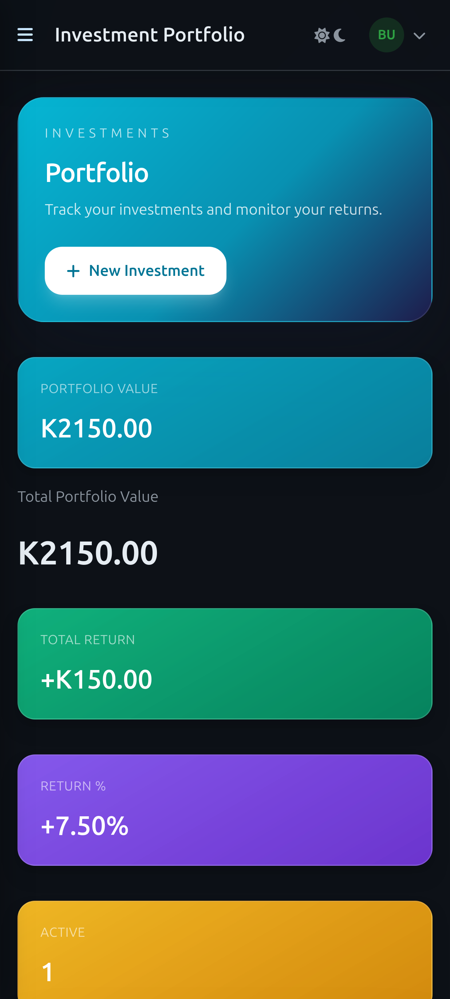

# Keelfin — Your Financial Companion

> Keelfin is a mobile-first personal finance app built for Zambia. It helps you manage budgets, track spending, monitor debts, set financial goals, and grow your investments — all from one unified dashboard. Built with Ruby on Rails and Tailwind CSS, it ships with real-time economic indicators (inflation, USD/ZMW), BNNB food basket benchmarks, and MTN MoMo / Airtel Money payment tracking.

## Live Demo

- 🌐 [keelfin.app](https://keelfin.app)
- 🎬 [Video Presentation](https://www.loom.com/share/215fbedd1dbd47b58d834e3c994c777b)

---

## Screenshots

### Login


### Dashboard


### Investment Portfolio


### Mobile Views

<table>
  <tr>
    <td align="center"><b>Navigation</b></td>
    <td align="center"><b>Income Sources</b></td>
    <td align="center"><b>Categories</b></td>
  </tr>
  <tr>
    <td></td>
    <td></td>
    <td></td>
  </tr>
  <tr>
    <td align="center"><b>Budget Management</b></td>
    <td align="center"><b>Recurring Transactions</b></td>
    <td align="center"><b>Debt Management</b></td>
  </tr>
  <tr>
    <td></td>
    <td></td>
    <td></td>
  </tr>
  <tr>
    <td align="center"><b>Financial Goals</b></td>
    <td align="center"><b>Investment Portfolio</b></td>
    <td></td>
  </tr>
  <tr>
    <td></td>
    <td></td>
    <td></td>
  </tr>
</table>

---

## Features

- **Dashboard** — Spending analytics, monthly trend charts, economic indicators, and a getting-started checklist
- **Income Sources** — Track monthly, weekly, or one-off income streams
- **Categories** — Customisable spending categories (fixed, variable, groceries, discretionary, essentials, luxury)
- **Payments** — Record and categorise transactions with MTN MoMo / Airtel Money / cash / bank support
- **Budgets** — Monthly limits per category with BNNB food-basket benchmarking
- **Recurring Transactions** — Auto-track rent, ZESCO, data bundles, and loan repayments
- **Debts** — Debt-to-income tracking, payoff strategies (avalanche & snowball), consolidation offers
- **Financial Goals** — Milestone-based saving and expense-reduction goals with progress history
- **Investments** — Portfolio tracking across stocks, bonds, mutual funds, fixed deposits, and mobile money savings
- **Subscriptions** — Free / Standard / Premium plan management
- **Economic Indicators** — Live Bank of Zambia inflation and USD/ZMW exchange rates
- **Admin Panel** — Full user and data management for administrators
- **Ledger Engine** — Double-entry accounting with asset, liability, equity, income, and expense accounts
- **REST API** — JWT-authenticated API for accounts, ledger transactions, audit logs, and webhooks
- **Async Webhooks** — HMAC-signed `transaction.posted` events delivered via Sidekiq

---

## ERD — Data Model


---

## Built With

- **Ruby 3.3.5**
- **Ruby on Rails 7.2**
- **PostgreSQL 16**
- **Tailwind CSS 4**
- **Hotwire** (Turbo + Stimulus)
- **Devise** — authentication
- **CanCanCan** — authorisation
- **Pagy** — pagination
- **Passenger + NGINX** — production server
- **devise-jwt** — JWT token authentication for the API
- **Sidekiq + Redis** — background jobs for transaction processing and webhook delivery
- **money-rails** — ZMW-first money handling

---

## Getting Started

### Prerequisites

- [Ruby 3.3.5](https://www.ruby-lang.org/en/documentation/installation/)
- [Rails 7.2](https://guides.rubyonrails.org/getting_started.html)
- [Node.js & npm](https://nodejs.org/)
- PostgreSQL

### Setup

```bash
git clone git@github.com:Mutalenic/keelfin.git
cd keelfin
gem install bundler
bundle install
```

### Environment variables

Copy the example and fill in your values:

```bash
cp .env.example .env   # then edit .env
```

Required variables:

| Variable             | Description                        |
|----------------------|------------------------------------|
| `ADMIN_PASSWORD`     | Password for the admin seed user   |
| `DEMO_USER_PASSWORD` | Shared password for demo seed users |
| `DEVISE_JWT_SECRET_KEY` | Secret used to sign API JWT tokens (falls back to `secret_key_base`) |
| `REDIS_URL`          | Redis connection string for Sidekiq |

### Services

The ledger engine uses Redis + Sidekiq for asynchronous work. Start Sidekiq with:

```bash
bundle exec sidekiq -C config/sidekiq.yml
```

The Sidekiq Web UI is mounted at `/sidekiq` and restricted to admin users.

### Database

```bash
rails db:create
rails db:migrate
rails db:seed
```

### Run locally

```bash
rails s
```

Open [http://localhost:3000](http://localhost:3000)

---

## Tests

```bash
bundle exec rspec
```

### Linting

```bash
bundle exec rubocop
```

For CSS/SCSS linting:

```bash
npx stylelint "app/assets/stylesheets/**/*.{css,scss}"
```

### Security audit

```bash
bundle exec brakeman
```

---

## REST API

The API is available under `/api/v1` and uses JWT Bearer tokens for authentication.

### Authentication

1. Obtain a token:

```bash
curl -X POST http://localhost:3000/api/v1/auth/sign_in \
  -H 'Content-Type: application/json' \
  -d '{"user":{"email":"you@example.com","password":"yourpassword"}}'
```

The response includes an `Authorization` header: `Bearer <jwt>`.

2. Use the token on subsequent requests:

```bash
curl -H 'Authorization: Bearer <jwt>' http://localhost:3000/api/v1/accounts
```

### Endpoints

| Method | Path | Description |
|--------|------|-------------|
| `POST`   | `/api/v1/auth/sign_in` | Sign in and receive a JWT |
| `DELETE` | `/api/v1/auth/sign_out` | Revoke the current JWT |
| `GET`    | `/api/v1/accounts` | List current user's accounts |
| `POST`   | `/api/v1/accounts` | Create a ledger account |
| `GET`    | `/api/v1/accounts/:id/balance` | Get account balance |
| `GET`    | `/api/v1/ledger_transactions` | List transactions |
| `POST`   | `/api/v1/ledger_transactions` | Post a double-entry transaction |
| `GET`    | `/api/v1/audit_logs` | Audit trail for ledger changes |
| `GET`    | `/api/v1/webhook_endpoints` | List webhook endpoints |
| `POST`   | `/api/v1/webhook_endpoints` | Register a webhook endpoint |
| `DELETE` | `/api/v1/webhook_endpoints/:id` | Remove a webhook endpoint |
| `GET`    | `/api/v1/webhook_deliveries` | List webhook delivery attempts |

### Webhooks

Webhook endpoints receive `POST` requests with a JSON body and three headers:

- `X-Keelfine-Event` — `transaction.posted`
- `X-Keelfine-Delivery-Id` — delivery attempt ID
- `X-Keelfine-Signature` — `sha256=<hmac>` (HMAC-SHA256 of the raw body using the endpoint secret)

All webhook deliveries are recorded in `Ledger::WebhookDelivery` and retried automatically on transient failures.

---

## Deployment

This app is deployed via Capistrano to a DigitalOcean VPS. See [DEPLOYMENT.md](DEPLOYMENT.md) for full instructions.

```bash
bundle exec cap production deploy
```

---

## Author

**Nicholas Mutale**

- GitHub: [@mutalenic](https://github.com/mutalenic)
- Twitter: [@nicomutale](https://twitter.com/nicomutale)
- LinkedIn: [nicomutale](https://linkedin.com/in/nicomutale)

## 🤝 Contributing

Contributions, issues, and feature requests are welcome!

Feel free to check the [issues page](https://github.com/Mutalenic/keelfin/issues).

## Show your support

Give a ⭐️ if you like this project!

## Acknowledgments

- Thanks [Gregoire Vella on Behance](https://www.behance.net/gregoirevella) for the original UI design inspiration.

## 📝 License

This project is [MIT](./MIT.md) licensed.  
[Creative Commons License of design](https://creativecommons.org/licenses/by-nc/4.0/)
