# Keelfin — Your Financial Companion

> Keelfin is a mobile-first personal finance app built for Zambia. It helps you manage budgets, track spending, monitor debts, set financial goals, and grow your investments — all from one unified dashboard. Built with Ruby on Rails and Tailwind CSS, it ships with real-time economic indicators (inflation, USD/ZMW), BNNB food basket benchmarks, and MTN MoMo / Airtel Money payment tracking.

## Live Demo

- 🌐 [keelfin.app](https://keelfin.app)
- 🎬 [Video Presentation](https://www.loom.com/share/215fbedd1dbd47b58d834e3c994c777b)

---

## Screenshots

### Login
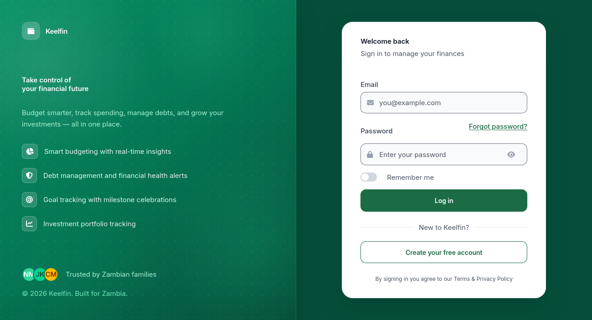

### Dashboard
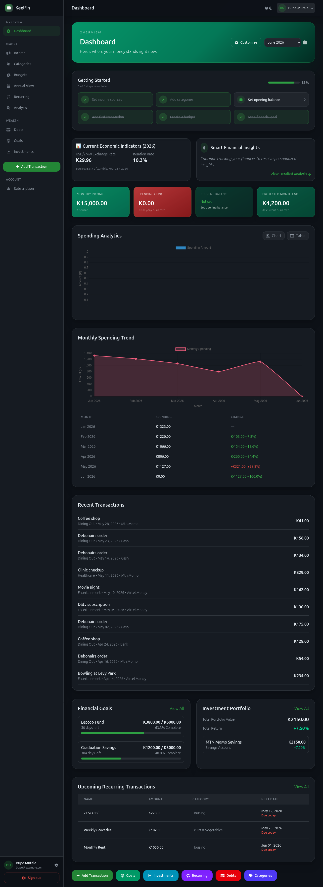

### Navigation
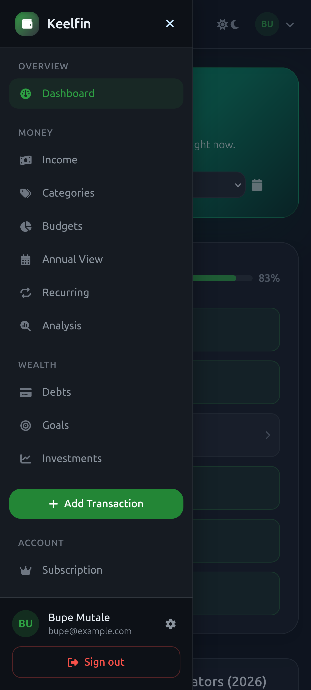

### Income Sources
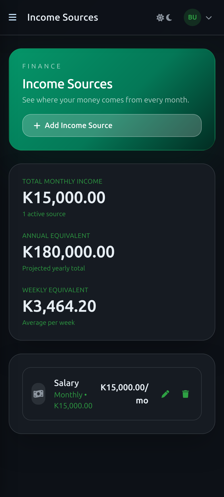

### Spending Categories
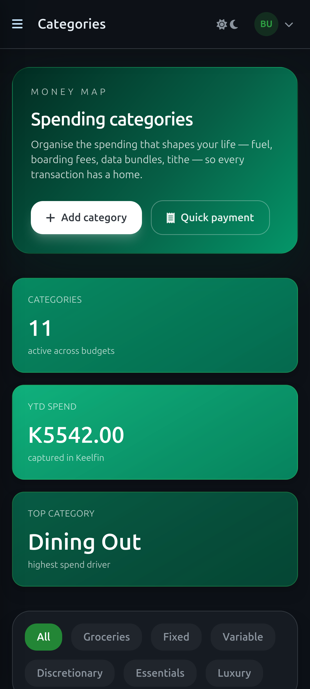

### Budget Management
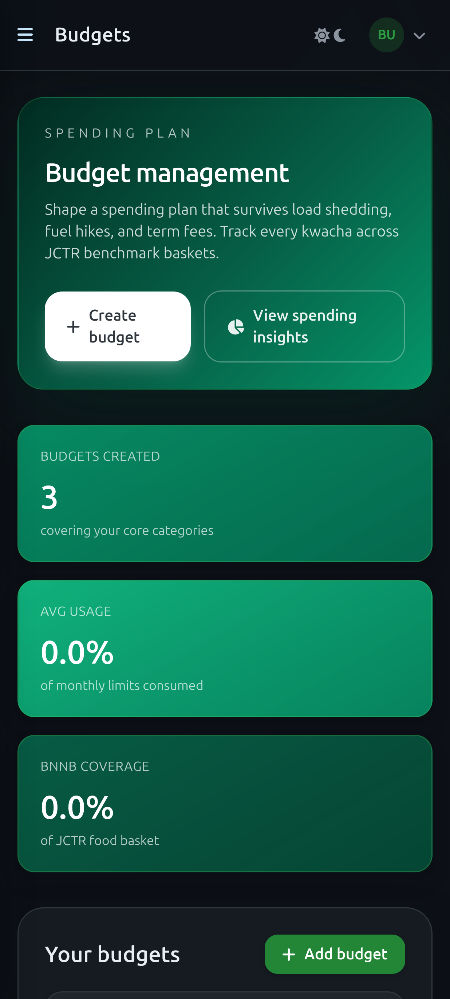

### Recurring Transactions
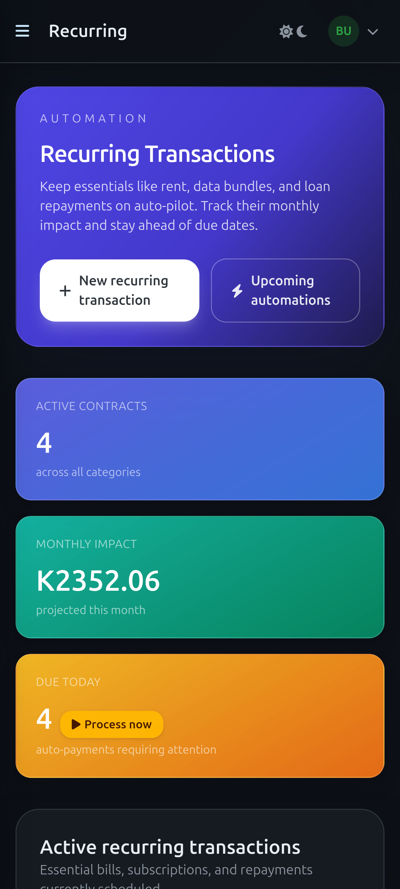

### Debt Management
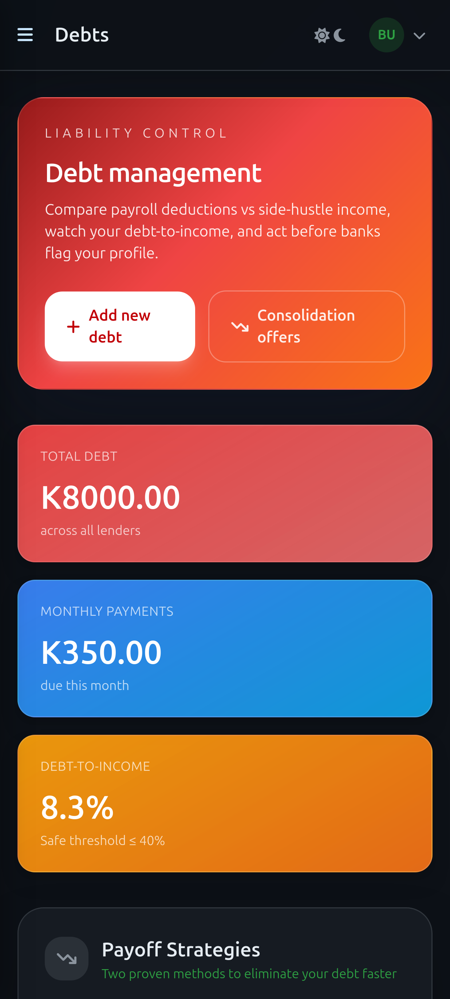

### Financial Goals
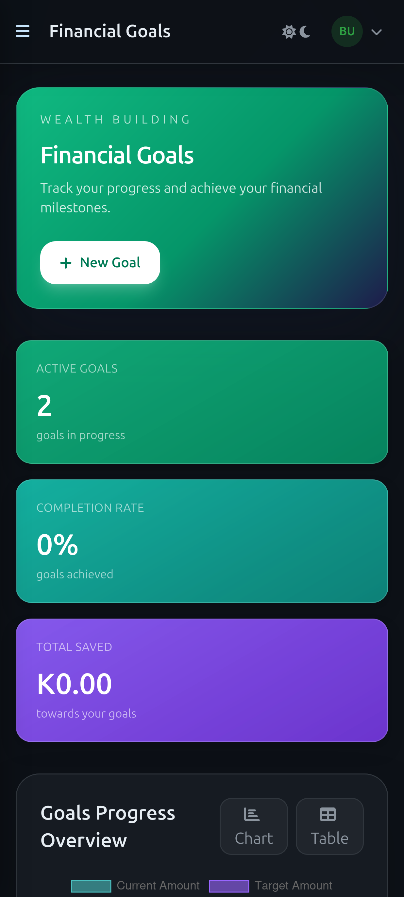

### Investment Portfolio
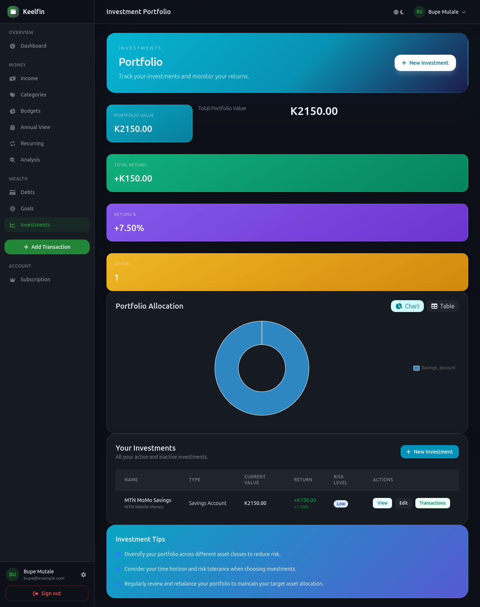

---

## Features

- **Dashboard** — Spending analytics, monthly trend charts, economic indicators, and a getting-started checklist
- **Income Sources** — Track monthly, weekly, or one-off income streams
- **Categories** — Customisable spending categories (fixed, variable, groceries, discretionary, essentials, luxury)
- **Payments** — Record and categorise transactions with MTN MoMo / Airtel Money / cash / bank support
- **Budgets** — Monthly limits per category with BNNB food-basket benchmarking
- **Recurring Transactions** — Auto-track rent, ZESCO, data bundles, and loan repayments
- **Debts** — Debt-to-income tracking, payoff strategies (avalanche & snowball), consolidation offers
- **Financial Goals** — Milestone-based saving and expense-reduction goals with progress history
- **Investments** — Portfolio tracking across stocks, bonds, mutual funds, fixed deposits, and mobile money savings
- **Subscriptions** — Free / Standard / Premium plan management
- **Economic Indicators** — Live Bank of Zambia inflation and USD/ZMW exchange rates
- **Admin Panel** — Full user and data management for administrators

---

## ERD — Data Model

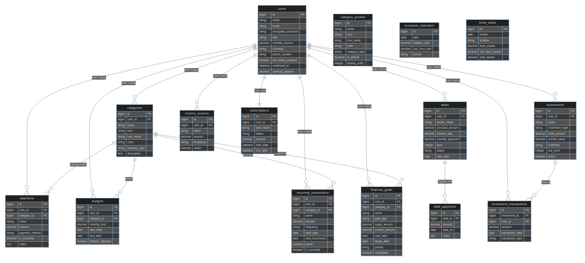

---

## Built With

- **Ruby 3.3.5**
- **Ruby on Rails 7.2**
- **PostgreSQL 16**
- **Tailwind CSS 4**
- **Hotwire** (Turbo + Stimulus)
- **Devise** — authentication
- **CanCanCan** — authorisation
- **Pagy** — pagination
- **Passenger + NGINX** — production server

---

## Getting Started

### Prerequisites

- [Ruby 3.3.5](https://www.ruby-lang.org/en/documentation/installation/)
- [Rails 7.2](https://guides.rubyonrails.org/getting_started.html)
- PostgreSQL

### Setup

```bash
git clone git@github.com:Mutalenic/keelfin.git
cd keelfin
gem install bundler
bundle install
```

### Environment variables

Copy the example and fill in your values:

```bash
cp .env.example .env   # then edit .env
```

Required variables:

| Variable             | Description                        |
|----------------------|------------------------------------|
| `ADMIN_PASSWORD`     | Password for the admin seed user   |
| `DEMO_USER_PASSWORD` | Shared password for demo seed users |

### Database

```bash
rails db:create
rails db:migrate
rails db:seed
```

### Run locally

```bash
rails s
```

Open [http://localhost:3000](http://localhost:3000)

---

## Tests

```bash
bundle exec rspec
```

### Linting

```bash
rubocop
```

### Security audit

```bash
bundle exec brakeman
```

---

## Deployment

This app is deployed via Capistrano to a DigitalOcean VPS. See [DEPLOYMENT.md](DEPLOYMENT.md) for full instructions.

```bash
bundle exec cap production deploy
```

---

## Author

**Nicholas Mutale**

- GitHub: [@mutalenic](https://github.com/mutalenic)
- Twitter: [@nicomutale](https://twitter.com/nicomutale)
- LinkedIn: [nicomutale](https://linkedin.com/in/nicomutale)

## 🤝 Contributing

Contributions, issues, and feature requests are welcome!

Feel free to check the [issues page](https://github.com/Mutalenic/keelfin/issues).

## Show your support

Give a ⭐️ if you like this project!

## Acknowledgments

- Thanks [Gregoire Vella on Behance](https://www.behance.net/gregoirevella) for the original UI design inspiration.

## 📝 License

This project is [MIT](./MIT.md) licensed.  
[Creative Commons License of design](https://creativecommons.org/licenses/by-nc/4.0/)
